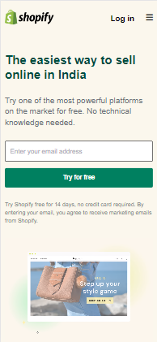

# Shopify Clone

##  Created by : [Gaurav Kumar](https://the-gaurav-portfolio.netlify.app/)

 

***

### Tech I Used
 

***

## My Key Learnings from this project

 

### In this project, I build a Shopify Clone Using Tailwind CSS

- I learned, how to defined colors in Tailwind CSS and use them.

- I learned, how to fixed the headeer while scrolling.

- I learned, about focus property of input box and how we can use border in input box.

- I learned, how to use .webm file in the project.

- I learned, how to use hover effect on buttons, footer links and etc. using Tailwind CSS

***

### Checkout the webiste : [Click Here](https://the-paytm.netlify.app/)

***
 

### How the PAYTM Clone is looking

 

### Website View

 

### Mobile View

 
